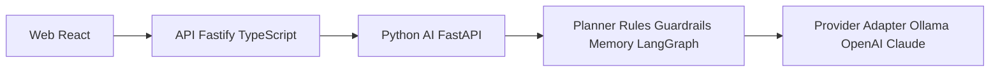
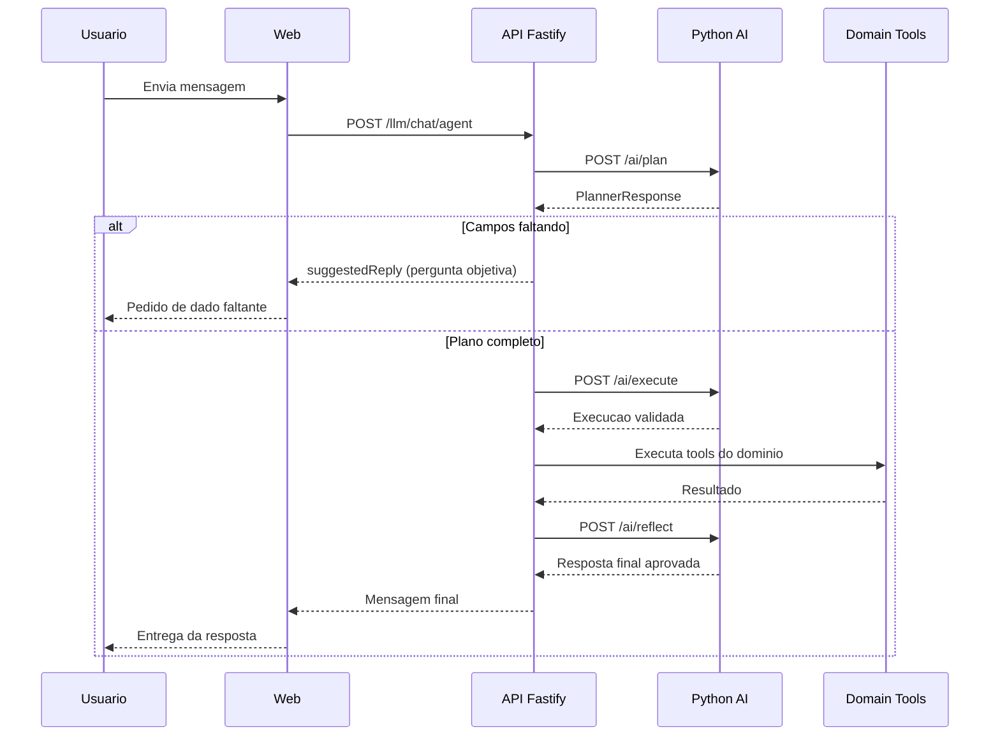

# schedule-ai

AI Scheduling Assistant para atendimento conversacional e agendamento com tool calling.

Projeto de demo full-stack orientado a portfólio: API de negócio, serviço de IA desacoplado, UI web, integração WhatsApp stub e execução local com Ollama.

https://github.com/user-attachments/assets/1d8303f6-5cb6-4444-b5ba-3849a673e432

## Stack

- Fastify + TypeScript (API de domínio)
- React + Vite (frontend)
- FastAPI + Python (planner e orquestração de IA)
- Ollama (local) + adapter para OpenAI/Claude
- LangGraph (orquestração de estados)
- Docker Compose
- PostgreSQL (serviço pronto no compose para evolução de persistência)

## O que este projeto demonstra

- Memória de sessão para contexto de conversa (com backend em memória ou SQLite)
- Tool calling controlado por plano estruturado
- Agenda e disponibilidade de horários
- Confirmação de ações antes de executar fluxos críticos
- Logs de requisição no serviço Python e tracing básico no fluxo do agente
- Arquitetura para extensão de domínio (dental hoje, outros domínios amanhã)

## Arquitetura



## Estrutura principal

```text
schedule-ai/
├── api/
├── web/
├── python-ai/
├── docs/
├── docker/
└── docker-compose.yml
```

## Documentacao

- docs/engenharia-ia-conceitos.md
- docs/demo.md
- docs/demo-fala.md
- docs/postgres-persistence.md

## Endpoints principais

### API (3001)

- GET /health
- GET /domain
- GET /catalog
- GET /slots?date=YYYY-MM-DD
- POST /bookings
- GET /bookings
- DELETE /bookings/:id
- GET /appointments?phone=
- GET /llm/status
- GET /llm/tools
- POST /llm/tools/invoke
- POST /llm/planner
- POST /llm/chat
- POST /llm/chat/agent
- POST /integrations/whatsapp/simulate-inbound

### Python AI (8001)

- GET /ai/health
- POST /ai/plan
- POST /ai/execute
- POST /ai/reflect
- GET /ai/memory/{session_id}
- DELETE /ai/memory/{session_id}

## Rodando localmente

### 1) Subir API + Web

```bash
npm install
npm run dev
```

### 2) Subir python-ai

```bash
cd python-ai
python -m venv .venv
# Windows PowerShell
.\.venv\Scripts\Activate.ps1
pip install -r requirements.txt
python main.py
```

### 3) Garantir Ollama disponível

```bash
ollama pull llama3.1
ollama run llama3.1
# se necessário
ollama serve
```

URLs de desenvolvimento:

- Web: http://localhost:5173
- API: http://localhost:3001
- Python AI: http://localhost:8001

## Rodando com Docker

```bash
docker compose up --build
```

Serviços:

- Web: http://localhost:8080
- API: http://localhost:3001
- Python AI: http://localhost:8001
- PostgreSQL: localhost:5432

## Refresh de sessao e memoria (PowerShell)

Quando parecer que a conversa ficou "em cache", normalmente e memoria de sessao persistida no python-ai.

### Sessao web (padrao)

Ver estado atual:

```powershell
Invoke-RestMethod -Method Get -Uri "http://localhost:8001/ai/memory/web-session" | ConvertTo-Json -Depth 8
```

Limpar sessao:

```powershell
Invoke-RestMethod -Method Delete -Uri "http://localhost:8001/ai/memory/web-session"
```

### Sessao WhatsApp por telefone

Formato do session_id: `wa:SEU_NUMERO`

Exemplo para 47933857058:

```powershell
Invoke-RestMethod -Method Get -Uri "http://localhost:8001/ai/memory/wa%3A47933857058" | ConvertTo-Json -Depth 8
Invoke-RestMethod -Method Delete -Uri "http://localhost:8001/ai/memory/wa%3A47933857058"
```

### Rebuild quando houver alteracao de codigo

```bash
docker compose up -d --build python-ai api
```

Observacoes:

- Nao cole links formatados pelo editor (ex.: markdown/vscode). Use sempre URL HTTP pura no parametro `-Uri`.
- `docker compose down -v` apaga volumes (incluindo dados de banco e memoria sqlite). Use somente quando quiser reset total.

## Variáveis importantes

### API

- AI_BASE_URL (default: http://localhost:8001)
- BUSINESS_DOMAIN (default: dental)
- WHATSAPP_PROVIDER (default: stub)
- SCHEDULE_PERSISTENCE (memory | postgres, default: memory)
- PGHOST, PGPORT, PGDATABASE, PGUSER, PGPASSWORD
- DATABASE_URL (opcional, alternativa aos PG*)

### python-ai

- LLM_PROVIDER (default: ollama)
- OLLAMA_URL (default: http://localhost:11434)
- OLLAMA_MODEL (default: llama3.1)
- MEMORY_BACKEND (memory | sqlite, default: memory)
- MEMORY_SQLITE_PATH (default: ./data/memory.db)

## Fluxo do agente

1. API recebe mensagem em POST /llm/chat/agent.
2. Python AI gera plano em POST /ai/plan.
3. Se faltam dados, retorna pergunta objetiva para completar campos.
4. Se o plano está completo, API executa tools no domínio.
5. Python AI faz reflexão em POST /ai/reflect e devolve resposta final.



## Agenda e bookings no PostgreSQL

O projeto agora suporta persistencia de agenda/agendamentos no banco sem mudar endpoints.

Como funciona:

1. Os slots continuam sendo gerados por regra (seg-sex, 8h-17h).
2. O que vai para o banco e' booking/appointment.
3. A disponibilidade e' calculada por `slot_id` reservado no Postgres.
4. A API usa `SCHEDULE_PERSISTENCE=postgres` para ativar o modo banco.

Arquivos principais:

- api/src/services/schedule-store.ts
- api/src/domains/dental/patient-store.ts
- api/src/services/pg.ts
- api/sql/001_init_schedule.sql

### Precisa de carga SQL?

Nao obrigatoriamente. O sistema funciona sem seed. A tabela comeca vazia e os dados entram pelos endpoints/tools.

Use seed apenas para demo visual (ex.: preencher alguns agendamentos para video).

### Migration SQL

Existe uma migration inicial em:

- api/sql/001_init_schedule.sql

Ela cria as tabelas `bookings` e `appointments` com indices e constraints.

## Roadmap para destaque no LinkedIn

- Persistência de agenda e memória em PostgreSQL
- Telemetria com correlação de request_id entre API e python-ai
- Conector real de WhatsApp (Baileys)
- Painel de observabilidade e histórico de conversas
- Suporte MCP para ferramentas externas de calendário/CRM

## Licença

MIT (ver LICENSE)
