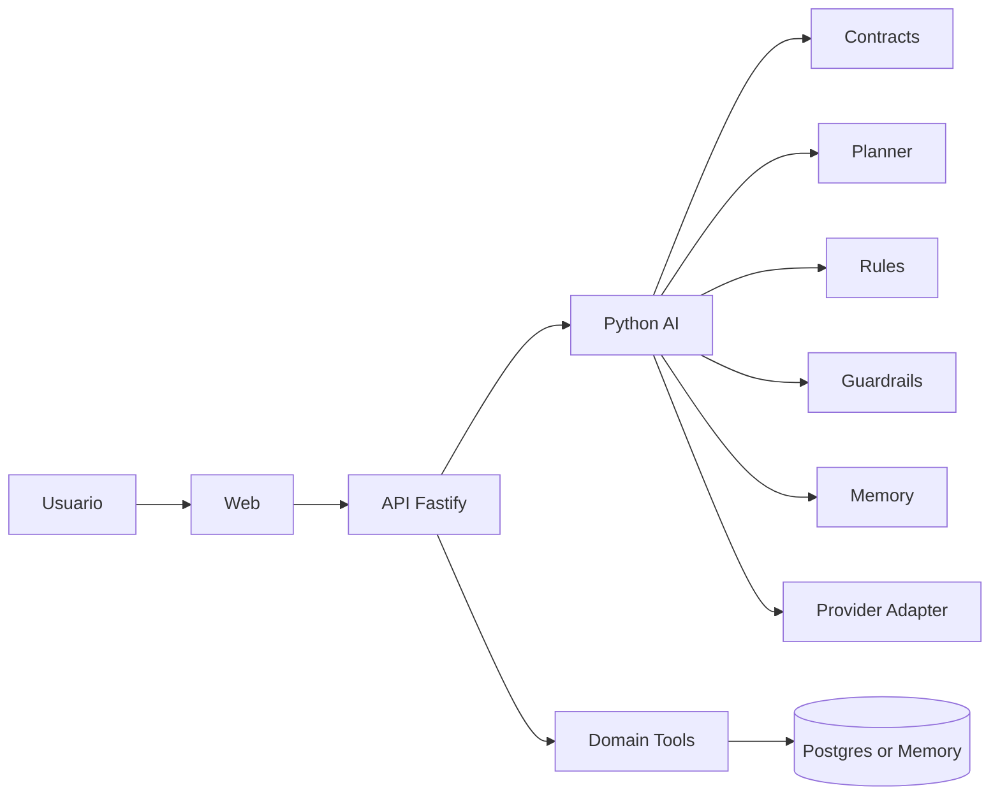
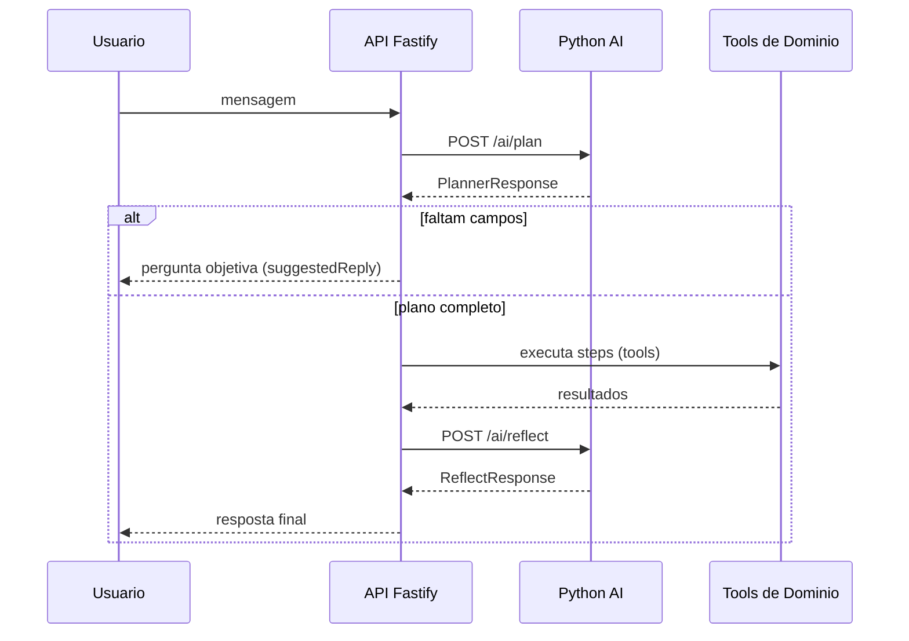

# Engenharia de IA no schedule-ai

Guia pratico para entender os blocos de IA do projeto e como eles se conectam no fluxo de agendamento.

## Objetivo

Este documento explica:

- O que cada componente faz
- Qual responsabilidade cada camada tem
- Como depurar problemas sem adivinhar
- Quando mudar regra, contrato, planner ou memoria

## Mapa rapido da arquitetura

## Fluxo ponta a ponta

## Conceitos centrais

### 1) Contratos

O que e:
Camada de tipos/schemas que define o formato oficial de entrada e saida entre servicos.

Responsabilidade:

- Garantir compatibilidade entre TypeScript e Python
- Evitar regressao silenciosa em campos
- Documentar o payload esperado por plan, execute e reflect

Onde no projeto:

- python-ai/contracts/planner.py
- api/src/services/ai-client.ts

Quando mexer:

- Ao adicionar campo novo em PlannerResponse/ReflectResponse
- Ao mudar o shape de steps, missingFields ou tool_args

Nao e papel de contratos:

- Decidir regra de negocio
- Escolher estrategia de prompt

### 2) Planner

O que e:
Componente que transforma mensagem do usuario em plano estruturado.

Responsabilidade:

- Inferir intent
- Extrair dados (nome, telefone, servico, data, horario)
- Dizer o que falta (missingFields)
- Definir steps sem executar nada

Onde no projeto:

- python-ai/planner/llm_planner.py

Entrada tipica:

- mensagem
- historico
- sessionId
- dominio

Saida tipica:

- intent
- confidence
- missingFields
- steps
- suggestedReply

Nao e papel do planner:

- Persistir agendamento
- Chamar banco diretamente
- Validar politicas de resposta final

### 3) Rules

O que e:
Motor deterministico de regras de negocio que valida o plano antes da execucao.

Responsabilidade:

- Garantir pre-condicoes de negocio
- Reprovar plano invalido cedo
- Tornar comportamento previsivel, independente de variacao do LLM

Onde no projeto:

- python-ai/rules/rules_engine.py

Exemplos de regras:

- Nao agendar sem telefone
- Nao aceitar dominio nao suportado
- Exigir campos obrigatorios para cada intencao

Quando mexer em rules:

- Mudanca de politica de negocio
- Novo dominio com regras proprias

### 4) Reflect

O que e:
Etapa de pos-processamento que recebe plano + resultado da execucao e produz a resposta final ao usuario.

Responsabilidade:

- Traduzir resultado tecnico em resposta natural
- Preservar contexto de sessao
- Ajustar mensagem final antes de devolver

Onde no projeto:

- python-ai/planner/llm_planner.py (metodo reflect_on_result)
- api/src/services/run-agent.ts (chamada do ciclo plan -> execute -> reflect)

Quando mexer em reflect:

- Melhoria de UX conversacional
- Mudanca de tom/estilo da resposta
- Inclusao de mensagens de fallback

### 5) Memory

O que e:
Armazenamento de contexto por sessao para o agente nao recomecar do zero a cada mensagem.

Responsabilidade:

- Guardar dados coletados (nome, telefone, servico etc.)
- Permitir continuidade da conversa
- Suportar backend em RAM ou SQLite

Onde no projeto:

- python-ai/memory/memory_store.py
- endpoints de debug em python-ai/routers/ai.py

Backends:

- memory (RAM)
- sqlite (persistente)

Variaveis relevantes:

- MEMORY_BACKEND
- MEMORY_SQLITE_PATH

### 6) Guardrails

O que e:
Camada de seguranca/qualidade para validar plano e resposta final.

Responsabilidade:

- Bloquear saida inadequada
- Evitar resposta fora de politica
- Sinalizar resposta nao aprovada

Onde no projeto:

- python-ai/guardrails/guardrails.py

Diferenca entre Rules e Guardrails:

- Rules: consistencia de negocio (deterministica)
- Guardrails: seguranca e qualidade de plano/resposta

## Separacao de responsabilidades

- Contratos definem formato
- Planner decide plano
- Rules validam negocio
- API executa tools
- Reflect escreve resposta final
- Guardrails validam seguranca/qualidade
- Memory preserva contexto de sessao

## Quando alterar cada camada

- Quero novo campo no payload entre Node e Python: contratos
- Quero nova estrategia de perguntas para completar dados: planner
- Quero endurecer politica de confirmacao: rules
- Quero ajustar texto final para usuario: reflect
- Quero manter contexto entre reinicios: memory (backend sqlite)
- Quero bloquear resposta inadequada: guardrails

## Erros comuns e diagnostico rapido

1. Planner retorna plano vazio
- Verificar provider e modelo do LLM
- Verificar timeout e conectividade com Ollama

2. Plano chega, mas tool falha na API
- Verificar shape dos args no step
- Verificar mapeamento de tool name no dominio

3. Agente pede dados repetidamente
- Inspecionar memoria da sessao
- Conferir se sessionId esta estavel entre mensagens

4. Reflect reprovado
- Verificar regras de guardrails
- Verificar dados enviados para reflect (plan + executionResult)

5. Regressao apos alterar schema
- Comparar contratos Python e TypeScript
- Validar campos obrigatorios e nomes identicos

## Checklist para evolucao segura

Antes de abrir PR de mudanca em IA:

- Atualizar contratos em Python e TypeScript
- Confirmar que planner nao executa regra de persistencia
- Cobrir regra de negocio nova em rules
- Validar resposta final no reflect com caso de sucesso e erro
- Testar sessao limpa e sessao com memoria

## Glossario

- Intent: objetivo do usuario (agendar, cancelar, consultar)
- Step: acao planejada para a API executar
- Missing field: dado obrigatorio ainda nao coletado
- Reflect: etapa que transforma resultado tecnico em resposta final
- Guardrail: validacao de seguranca/qualidade antes de responder
- Session memory: contexto acumulado por sessao

## Referencias do projeto

- README.md
- python-ai/README.md
- api/src/services/run-agent.ts
- api/src/services/ai-client.ts
- python-ai/contracts/planner.py
- python-ai/planner/llm_planner.py
- python-ai/rules/rules_engine.py
- python-ai/guardrails/guardrails.py
- python-ai/memory/memory_store.py
