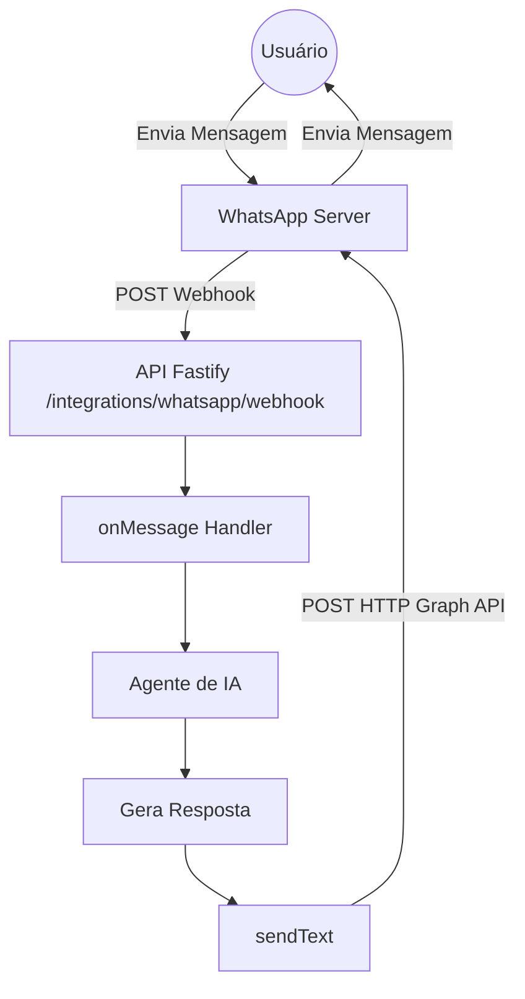

# Plano de Implantação da API Oficial do WhatsApp Cloud 🚀

Este plano detalha as etapas necessárias para integrar a API do agendador (`api`) com a **API Oficial do WhatsApp Cloud** (Meta Graph API) usando o novo chip de testes. Esta abordagem oferece maior segurança, conformidade e elimina o risco de banimento de número associado à emulação de WhatsApp Web.

---

## 📋 Visão Geral da Arquitetura

O provedor `CloudWhatsAppProvider` implementará a interface [WhatsAppProvider](file:///c:/Users/Rodrigo/Projetos/schedule-ai/api/src/whatsapp/types.ts). A API oficial opera de forma stateless baseada em requisições HTTP e Webhooks públicos.



---

## 🛠️ Passo a Passo de Configuração na Meta

Para utilizar o chip na API Oficial, é necessário configurá-lo no painel da Meta:

1.  **Meta for Developers**:
    *   Criar uma conta em [developers.facebook.com](https://developers.facebook.com/).
    *   Criar um novo aplicativo do tipo **Negócios (Business)**.
    *   Adicionar o produto **WhatsApp** ao aplicativo.
2.  **Configuração do Número (Chip Novo)**:
    *   No painel do WhatsApp do aplicativo, ir para a seção de configuração de número.
    *   Adicionar o novo número de telefone e realizar a verificação via SMS ou ligação.
    *   > [!IMPORTANT]
        > Ao registrar o número na plataforma Business da Meta, ele deixará de funcionar no aplicativo de celular do WhatsApp tradicional ou Business comum.
3.  **Obter Credenciais**:
    *   Anotar o **ID do Número de Telefone** (`Phone Number ID`).
    *   Gerar um **Token de Acesso temporário** (para testes) ou criar um **System User** no Business Manager para obter um **Token de Acesso Permanente** (recomendado para produção).

---

## 💻 Alterações no Código (`api`)

### 1. Variáveis de Ambiente
Configurar no `.env` do diretório `api`:
```env
WHATSAPP_PROVIDER=cloud
WHATSAPP_ACCESS_TOKEN=seu_access_token_da_meta
WHATSAPP_PHONE_NUMBER_ID=seu_phone_number_id
WHATSAPP_VERIFY_TOKEN=token_de_verificacao_criado_por_voce
```

### 2. Implementação do Provedor (`cloud-provider.ts`)
Criar o arquivo `cloud-provider.ts` em `api/src/whatsapp/` implementando `WhatsAppProvider`:

*   **`sendText(to, body)`**:
    *   Faz uma requisição `POST` para `https://graph.facebook.com/v20.0/${PHONE_NUMBER_ID}/messages` utilizando `fetch` (nativo do Node.js/TS).
    *   Envia o cabeçalho `Authorization: Bearer ${ACCESS_TOKEN}`.
    *   Payload JSON formatado:
        ```json
        {
          "messaging_product": "whatsapp",
          "recipient_type": "individual",
          "to": "5511999999999",
          "type": "text",
          "text": { "body": "Texto da resposta" }
        }
        ```
*   **`onMessage(handler)`**: Mapeia o callback para processar os payloads recebidos no webhook.

### 3. Integração do Webhook no Fastify
Modificar as rotas de webhook no arquivo [index.ts](file:///c:/Users/Rodrigo/Projetos/schedule-ai/api/src/index.ts) para delegar ao provedor:

*   **`GET /integrations/whatsapp/webhook`**:
    *   Valida a assinatura enviada pela Meta comparando `hub.verify_token` com o `WHATSAPP_VERIFY_TOKEN`.
    *   Responde com `hub.challenge` se válido.
*   **`POST /integrations/whatsapp/webhook`**:
    *   Extrai a mensagem do payload JSON da Meta:
        `entry[0].changes[0].value.messages[0]`
    *   Mapeia o remetente (`from`) e o corpo do texto (`text.body`).
    *   Chama o callback cadastrado pelo `onMessage`.

### 4. Atualização da Factory
Ajustar o arquivo [factory.ts](file:///c:/Users/Rodrigo/Projetos/schedule-ai/api/src/whatsapp/factory.ts):
```typescript
export type WhatsAppProviderKind = "stub" | "cloud";
// ... retornar instâncias conforme a configuração
```

---

## 🧪 Plano de Testes em Desenvolvimento

1.  **Exposição Local (Túnel HTTPS)**:
    *   A API oficial exige que o webhook seja HTTPS público. Utilizaremos o **ngrok** ou **Cloudflare Tunnels** para expor a porta local `3001`:
        ```bash
        ngrok http 3001
        ```
    *   Copiar a URL HTTPS gerada (ex: `https://abcd-123.ngrok-free.app`).
2.  **Configuração do Webhook no Painel da Meta**:
    *   Configurar a URL do webhook como: `https://abcd-123.ngrok-free.app/integrations/whatsapp/webhook`.
    *   Definir o Token de Verificação idêntico ao `WHATSAPP_VERIFY_TOKEN`.
    *   Assinar os campos de evento de mensagens (`messages`).
3.  **Envio e Recebimento**:
    *   Enviar mensagem do número pessoal para o novo chip.
    *   Validar no terminal local que a API Fastify recebe a requisição no webhook e que o Agente de IA responde corretamente através da Graph API.

---

## ⚠️ Regras de Janela de Mensagens da Meta

*   **Conversas iniciadas pelo usuário (User-initiated)**: Quando o cliente envia uma mensagem para o bot, abre-se uma janela de **24 horas** de atendimento livre. Dentro desta janela, o bot pode enviar qualquer mensagem de texto livre sem custos elevados ou necessidade de aprovação.
*   **Conversas iniciadas pelo negócio (Business-initiated)**: Para enviar uma mensagem fora da janela de 24 horas (como lembretes automáticos de agendamento subsequentes), **deve-se** utilizar um **Template de Mensagem** pré-aprovado pela Meta (Message Template).
